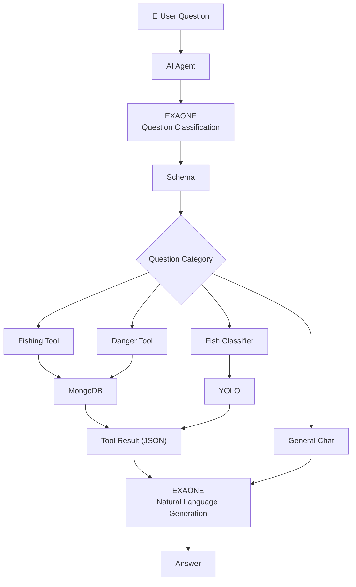

---

# 📁 Project Structure

```text
src/
└── kakaoapi/
    │
    ├── main.py
    │
    ├── routers/
    │     ├── chat.py
    │     ├── fishing.py
    │     └── danger.py
    │
    ├── services/
    │     └── agent.py
    │
    ├── schemas/
    │     └── schemas.py
    │
    ├── tool/
    │     ├── fishing_tool.py
    │     ├── danger_tool.py
    │     └── fish_classifier.py
    │
    ├── templates/
    │     └── location.html
    │
    └── static/
          ├── location.js
          └── location.css
```

---

# 🔄 AI Agent Workflow



---

# 🧩 Components

### 🌐 Front-End

- location.html
- location.css
- location.js

↓

### 🚀 FastAPI

- main.py
- chat.py

↓

### 🤖 AI Agent

- 질문 의도 분류
- Tool 선택
- Session 관리
- Tool 결과 관리

↓

### 🧠 EXAONE

- 질문 분류
- 자연어 응답 생성

↓

### 🔧 Tool Layer

- Fishing Tool
- Danger Tool
- Fish Classifier

↓

### 🗄 Database / AI

- MongoDB (낚시장소)
- MongoDB (위험구역)
- YOLO (어종분류)

↓

### 👤 User Response